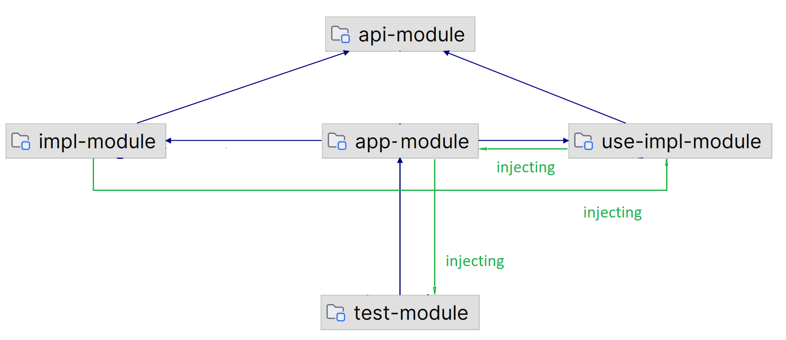

# Spring context detecting in the multi-module Spring Boot Maven project

1. Autowiring dependencies within the sibling projects (the beans are available in the context of the application module that depends on both siblings)
2. Autowiring dependencies when the context is defined in the required or dependent projects

To check:

- in the `com.mytests.spring.multiModuleCheck.useBeans.UserComponent` class (`use-impl-module` module)
    - check that no autowiring errors are shown, navigation via gutter icon to the beans defined in `impl-module` works
    - check that navigation back to the `com.mytests.spring.multiModuleCheck.useBeans.UserComponent` also works
- in the `com.mytests.spring.multiModuleCheck.TestService` class (`test-module`)
    - check that no autowiring errors are shown, 
    - check that navigation to the injected `com.mytests.spring.multiModuleCheck.AppService` component from 'app-module' works
    - (back navigation doesn't work for now)
